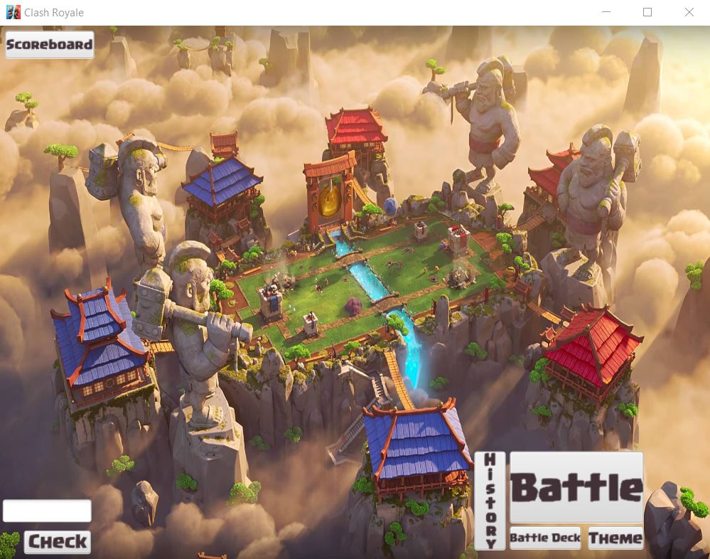
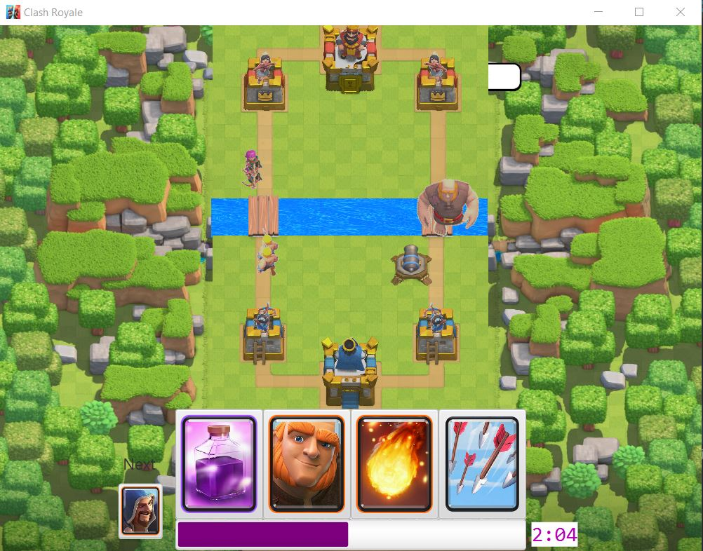
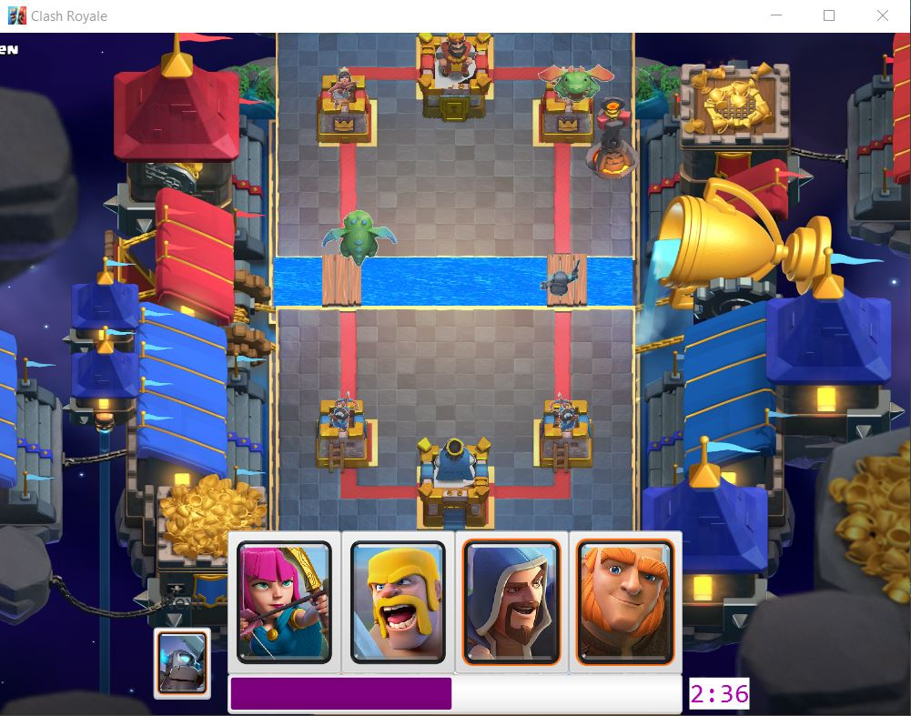
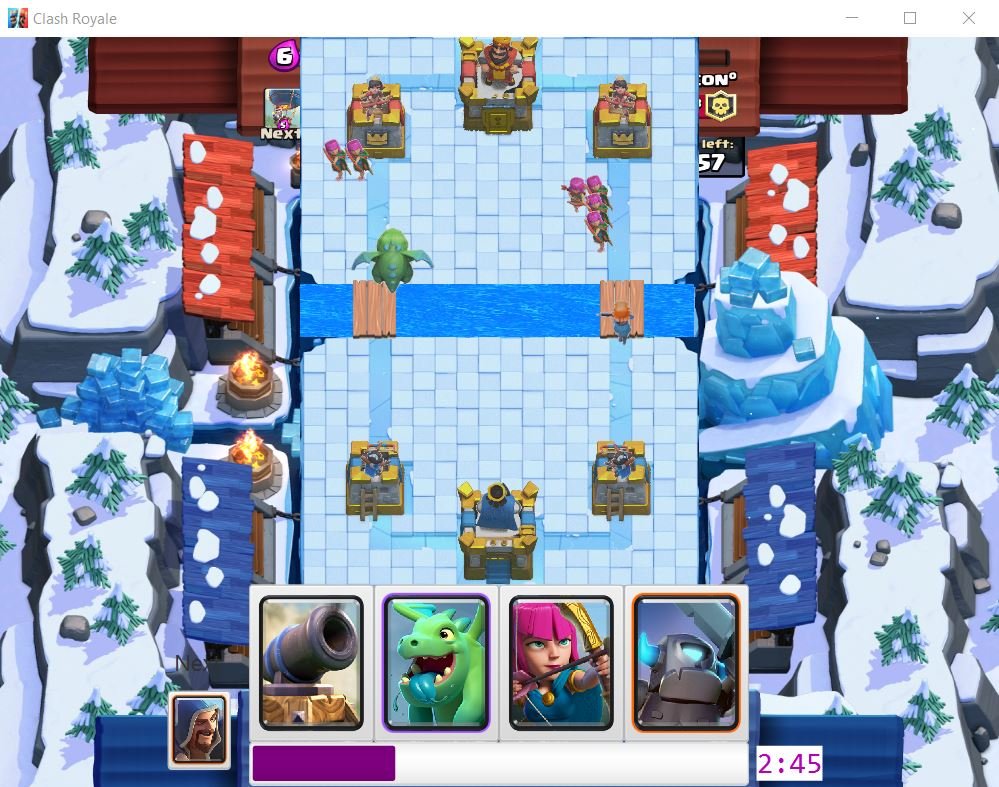
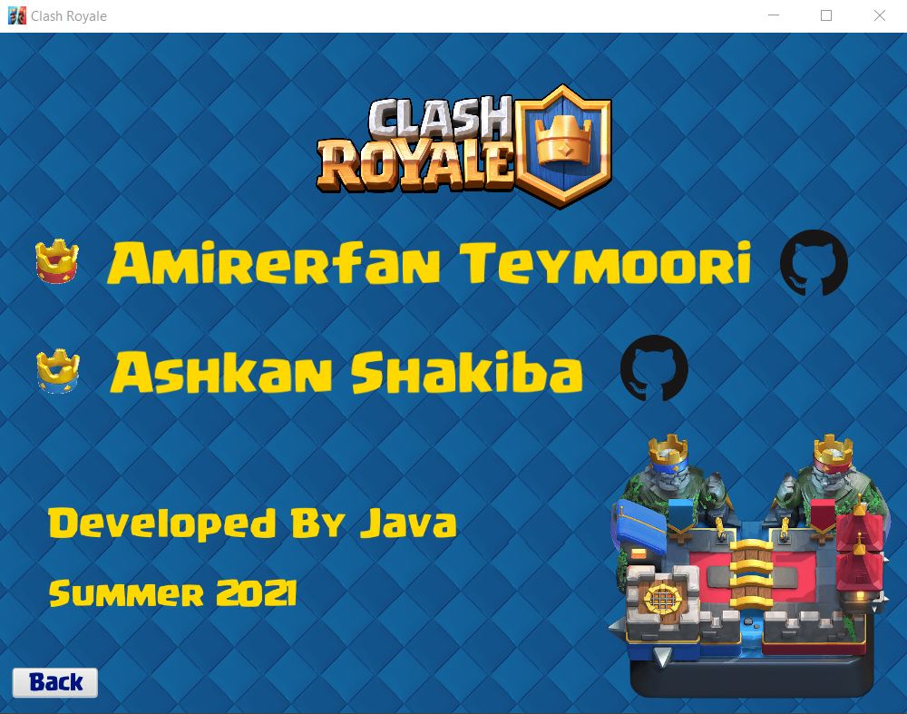

# Clash Royale

Advanced Programming Final Project  
Clash Royale By Java  
July 2021

## Requirements

Java and JavaFx SDK  
MySQL Database

## Screenshots
  
  
  
  
  
  

## How to run

Import mySQL-connector library from 
```
src/libraries/mysql-connector.jar  
```

Set VM options as:
```
--module-path "D:\Sources\javafx-sdk-16\lib" --add-modules javafx.controls,javafx.media,javafx.fxml
```
Create a database named as "clashroyalehub" and import data from
```
data/clashroyalehub_userdata.sql
```
Username: root  
Password: password